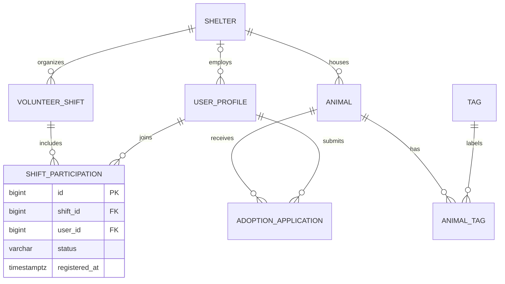
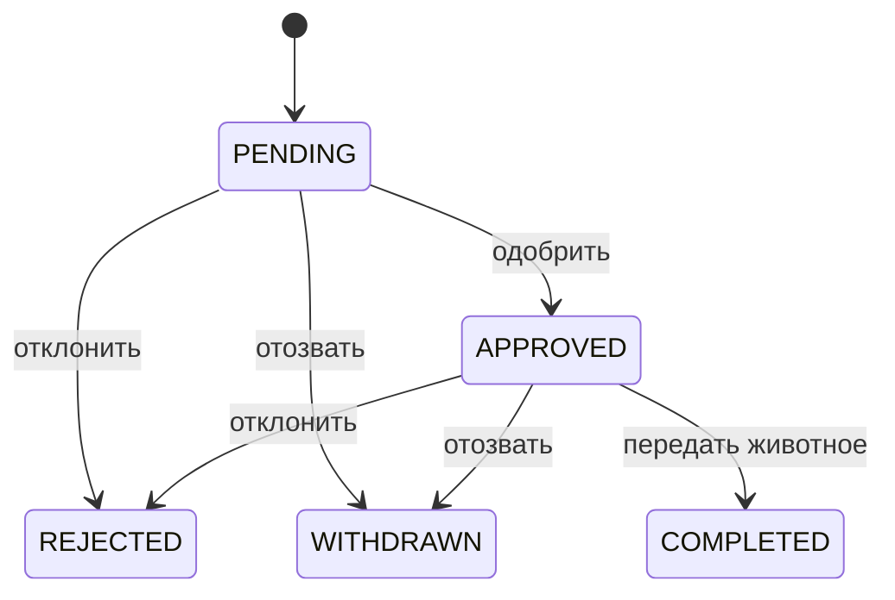

# Архитектура и предметная область

HTTP → Controller → Service → Repository → PostgreSQL.

Контроллеры принимают DTO и валидируют запросы; сервисы реализуют сценарии и границы транзакций; репозитории работают через Spring Data JPA; Entity описывают хранение и собственные ограничения. Маппинг в DTO выполняется внутри сервисной транзакции. `open-in-view=false`, Entity напрямую в JSON не сериализуются.

`CatalogService` обслуживает справочники приютов, профилей и тегов; `AnimalService` — каталог животных; `AdoptionService` — заявки и передачу; `VolunteerService` — смены и участие. Обработчик ошибок и настройки Swagger общие для приложения.

## Схема данных

- `Animal.shelter`, `AdoptionApplication.animal` и другие внешние ключи реализуют Many-to-One, то есть обратную сторону One-to-Many. Коллекции заявок/животных читаются отдельными пагинированными запросами, чтобы не отдавать неограниченный граф.
- `Animal.tags` — `@ManyToMany` через `animal_tags` без дополнительных бизнес-полей.
- `ShiftParticipation` — отдельная Entity для Many-to-Many с дополнительными полями: статусом и временем записи.
- Все enum хранятся строками через `EnumType.STRING`; миграция добавляет CHECK допустимых значений.
- Схему создаёт `V1__create_shelter_schema.sql`; Hibernate только проверяет её через `ddl-auto=validate`.

## Статусы и ограничения

Животное: `AVAILABLE → ADOPTED`. Обратного перехода в ЛР №1 нет; после передачи карточка сохраняется как история и не редактируется.

Заявка:

При передаче все остальные `PENDING`/`APPROVED` заявки на животное становятся `REJECTED`. У одного пользователя может быть только одна активная заявка на одно животное; у животного — только одна одобренная и одна завершённая заявка. Это проверяется сервисом и частичными уникальными индексами PostgreSQL.

Смена: `SCHEDULED → CANCELLED`. Запись, редактирование и отмена разрешены до начала смены. Начало должно быть в будущем, окончание — позже начала, вместимость `1..1000`. Вместимость нельзя уменьшить ниже количества активных участников.

Участие: `REGISTERED → CANCELLED`; повторная запись восстанавливает `REGISTERED` с новым временем регистрации. Пара `(shift_id,user_id)` уникальна, id сохраняется. При отмене смены отменяются все активные участия. Поле занятых мест не хранится отдельно: число активных участий является единственным источником данных о заполнении.

При создании заявитель должен иметь роль `APPLICANT`, участник смены — `VOLUNTEER`. Это проверки модели, а не авторизация HTTP-запроса.

## Транзакция 1: передача животного

Метод `AdoptionService.complete`:

1. Определяет животное и блокирует его строку `PESSIMISTIC_WRITE` (`SELECT ... FOR UPDATE`).
2. Читает актуальную заявку после получения блокировки.
3. Проверяет `AVAILABLE` и `APPROVED`.
4. Меняет животное на `ADOPTED`, выбранную заявку — на `COMPLETED`.
5. Одним bulk UPDATE закрывает остальные активные заявки.
6. Коммитит все изменения вместе.

Без транзакции можно передать животное, оставив заявку активной, либо закрыть заявки, не передав животное. При ошибке откатываются все изменения. Один `@Transactional` без сериализации конкурентных проверок не исключает двойную передачу: поэтому все изменения заявок и животного используют одну и ту же блокировку животного.

Интеграционные тесты проверяют полное изменение состояния, два одновременных вызова и откат при намеренно вызванной ошибке PostgreSQL.

## Транзакция 2: запись на смену

Метод `VolunteerService.enroll`:

1. Блокирует строку смены через `PESSIMISTIC_WRITE`.
2. Проверяет статус, время, роль, отсутствие повторного активного участия.
3. Подсчитывает активные участия и сравнивает с вместимостью.
4. Создаёт или восстанавливает участие и фиксирует транзакцию.

Блокируется именно родительская строка смены, существующая даже при отсутствии участников. Все операции, меняющие вместимость и участие, берут эту блокировку. Поэтому второй запрос на последнее место ждёт коммита первого и затем получает `409`. Блокировка освобождается при коммите/откате.

Дополнительная транзакция `VolunteerService.cancel` вместе отменяет смену и её активные участия.

## Удаление и история

- Приют/пользователь с зависимыми записями не удаляется: FK приводит к `409`.
- Животное с заявками не удаляется; переданное животное также защищено бизнес-правилом.
- Удалять можно отклонённые/отозванные заявки; завершённые сохраняются.
- Участие удаляется после отмены. Смена с любыми участиями не удаляется до удаления зависимостей.
- Удаление тега удаляет только строки связи, не животных.

Изменения БД выполняются новыми миграциями. Номера миграций необходимо согласовывать между участниками.
